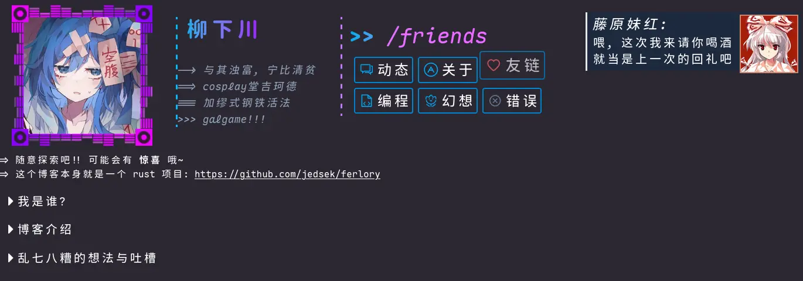

# Ferlora

My personal new generation blog, based on [Dioxus](https://dioxuslabs.com/)  
(WIP.)  

This is also a learning tour/challenge:  
- using `rand` in wasm32-unknown-unknown (dependencies problem)  
- making `vnode placeholder` div in dioxus  
- parsing `typst` && `makrdown`
- tailwind-css
- rewriting all posts in pure rust (RIIR :))  
- more...
